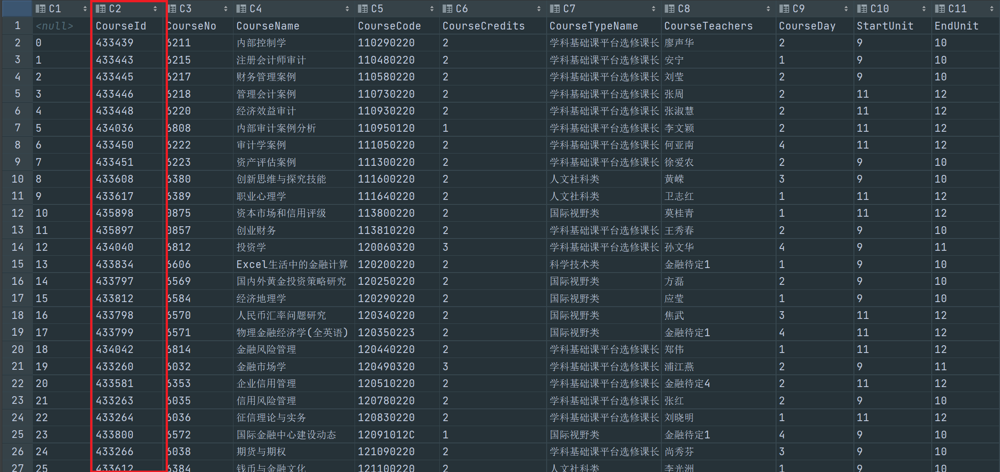

# AutomaticCoursesElectingSystem_SLU

### 介绍
**立信的同志们！**  
还在为选课选不上而苦恼吗？还在为卡到爆的教务系统而头疼吗？  
**你，来对地方了！**  

本项目提供了一套免费的自动选课系统，你只需要按照下面的说明在系统中填入最基本的信息  
**就能获得全自动的高级选课体验！** 

### 安装教程

1.  在下图中标记的位置点颗星（只有点了星才能正常下载，不然会报错）  
    
    

2.  点击图中"克隆/下载"按钮并点击下载zip(也可直接使用git),把文件保存到你喜欢的位置
    
    

3.  **安装完成啦( •̀ ω •́ )✧**

### 使用说明

1.  找到`Data.py`文件并打开他
    

2.  在下面指定位置中填入个人信息（coursePool先别填），别填错，不然程序跑不了
    
    

3.  如果你还处于第一轮选课期间（通常不采取先到先得原则），请打开`RunBeforeElecting.py`并运行，  
    他会帮助你获得本学期的可选课程列表。  
    【第一轮选课结束了？没关系，我们会定期提供副本，你来下载就行了（￣︶￣）↗　】
    

4.  打开`CourseList.csv`查找自己想选的课并记录他的courseId（注意别选错，仔细看下图）
    
    图解：CourseCode是我们熟知的课程代码，CourseDay是在哪一天上课，startUnit与endUnit是上课的节数
    

6.  现在回到`Data.py`中把自己选中的courseId填入coursePool中  

7.  打开`Main.py`并运行他（建议在选课开始前20分钟左右开启程序，程序会自动进入休眠状态，请勿关闭）

8.  大功告成ヾ(•ω•`)o

### 参与贡献

1.  分享给你的朋友们
    

2.  Fork 本仓库
    

3.  新建 Feat_AutomaticCoursesElectingSystem_SLU 分支
    

4.  提交代码
    

5.  新建 Pull Request

### 其他

特别鸣谢cloudy同志为本项目做出的技术支持，在本项目之前cloudy同志已经用他的技术原型帮助了很多届同学  
下面是技术原型的地址，有时间的话就去给他点个星吧!  
(https://github.com/cloudy-sfu/SLU_AutoScriptForNewCourseSystem)

### 免责声明
没选上课或者出现别的奇怪问题不要怪我，自愿选择＞﹏＜